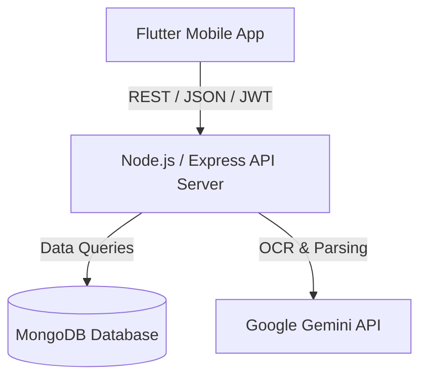

# System Architecture

SmartScanner Pro operates on a multi-tier Client-Server topology linking a Flutter frontend, a Node.js REST API, and remote MongoDB / Gemini API services.

## Architecture Diagram

## Layers and Interfaces
1.  **Frontend Client (Flutter):** Connects to the Express backend via the `http` package, carrying JWT headers for session authentication.
2.  **API Gateway (Express):** Hosts the routes (`/auth`, `/receipts`, `/gallery`, `/budget`), acts as the authentication wall, and orchestrates database transactions and AI requests.
3.  **Data Tier (MongoDB):** Stores users, receipts, budgets, and base64 gallery image records.
4.  **Generative AI Layer (Gemini):** Processes receipt images uploaded by the backend to identify total values, merchants, dates, and categories.
